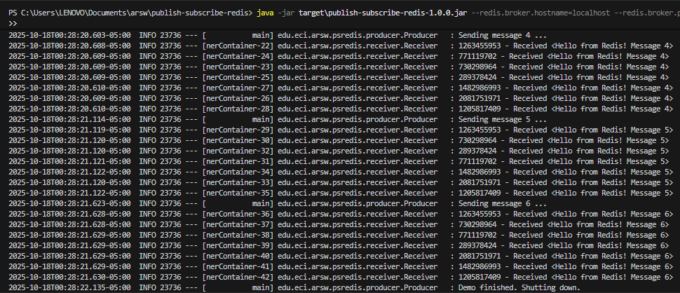

# Spring Boot con Redis Publish/Subscribe 


## Objetivo
- Implementar la arquitectura *publish–subscribe* donde un **productor** envía mensajes a un **tópico** y varios **listeners** los reciben simultáneamente.
- Replicar los pasos de la **guía** (crear proyecto, configurar POM, crear clases de conexión/plantilla/receiver/productor, ejecutar).

## Estructura del proyecto
- `PSRedisPrimerAppStarter` (arranque de Spring)
- `config/PSRedisConnectionConfiguration` (fábrica de conexiones Lettuce → Redis)
- `connection/PSRedisListenerContainer` (contenedor de listeners, multiplexado)
- `connection/PSRedisTemplate` (template de Strings para publicar)
- `receiver/Receiver` (MessageListenerAdapter, método `receiveMessage`)
- `producer/Producer` (CommandLineRunner, registra listeners y publica mensajes)
- `application.properties` (host/puerto de Redis)

## Requisitos
- Java 21
- Maven 3.9+
- Docker (para levantar Redis fácilmente)

## Ejecución paso a paso
- **Parte 1 – Preparar aplicación Maven**
  - Creado como **Spring Boot** con Java 21 y estructura estándar de Maven.
- **Parte 2 – Configurar el POM**
  - Se usa `spring-boot-starter-parent:3.3.4` y dependencias:
    - `spring-boot-starter` y `spring-boot-starter-data-redis` (Lettuce por defecto).
    - **Java 21** configurado vía `maven-compiler-plugin` con `<release>21</release>`.
- **Parte 3 – Crear la aplicación**
  - `PSRedisPrimerAppStarter` inicia el contexto.
  - `PSRedisConnectionConfiguration` crea `LettuceConnectionFactory` leyendo:
    - `redis.broker.hostname` y `redis.broker.port` desde `application.properties`.
  - `PSRedisListenerContainer` extiende `RedisMessageListenerContainer` y fija la *connection factory*.
  - `PSRedisTemplate` extiende `StringRedisTemplate` (operaciones con `String` convenientes).
  - `Receiver` extiende `MessageListenerAdapter`, define `receiveMessage(String)` y lleva un contador interno (scope **prototype** para instancias múltiples).
  - `Producer` (CommandLineRunner):
    - Obtiene 7 instancias `Receiver` desde el contexto y las registra al tópico `PSChannel`.
    - Publica 6 mensajes usando `template.convertAndSend("PSChannel", ...)` con pausas de 500 ms.
    - Finaliza el proceso con `System.exit(0)` al terminar el demo.
- **Parte 4 – Ejecutar la aplicación**
  1) Levantar Redis con Docker (mapea 45000→6379):
     ```bash
     docker run --name psredis -p 45000:6379 -d redis:7-alpine
     ```
     > Alternativa: `docker compose up -d` usando el `docker-compose.yml` incluido.
  2) Compilar y correr la app:
     ```bash
     mvn -q -DskipTests package
     java -jar target/publish-subscribe-redis-1.0.0.jar
     ```
  3) Ver en consola:
     - “Sending message …”
     - Varias líneas “`<hash>- Received <Hello from Redis! Message X>`” (diferentes receivers).

  **Si falla: Ubuntu (WSL2) y Redis:**
      
      Abre PowerShell como Administrador

      - En inicio escribe PowerShell y dale clic derecho, Run as administrator.

    **Habilitar WSL2** 

    - En PowerShell (Admin) pega:

          dism.exe /online /enable-feature /featurename:Microsoft-Windows-Subsystem-Linux /all /norestart
      
          dism.exe /online /enable-feature /featurename:VirtualMachinePlatform /all /norestart

          wsl --set-default-version 2

          shutdown /r /t 0

      Se reiniciará el PC

    **Instalar Ubuntu**

    - Abre PowerShell o CMD normal y ejecuta:
          
           wsl --install -d Ubuntu

        Alternativa: En Microsoft Store busca Ubuntu e Instalalo
      
    - Verifica:
          
          wsl -l -v

      - Si ves “Ubuntu … VERSION 2”, perfecto.
        
      - Si sale versión 1: wsl --set-version Ubuntu 2
      
    **Abrir Ubuntu y crear cuenta**

      - Inicio busca Ubuntu (o en PowerShell/CMD: wsl -d Ubuntu).

      En el primer arranque:

        - Ingresa UNIX username 

        - Ingresa password y confírmala (no se ve al escribir, es normal).

    **Instalar Redis dentro de Ubuntu**

    - En la terminal de Ubuntu:
          
          sudo apt update
          
          sudo apt install -y redis-server

    **Arranca Redis (elige una):**

    - Rápido (recomendado en WSL):

          redis-server --daemonize yes
       
    - (Si tienes systemd activo en WSL):
      
          sudo systemctl enable --now redis-server
      
    **Probar Redis:**

          redis-cli ping   # Debe responder: PONG

    **Ejecutar tu JAR desde CMD (Windows)**

    - Abre CMD y ve a la ruta donde tienes el proyecto y ejecuta:

          mvn -q -DskipTests package
        
          java -jar target\publish-subscribe-redis-1.0.0.jar --redis.broker.hostname=localhost --redis.broker.port=6379

  Donde tiene que salir algo asi: 

## Ejemplo de ejecución:


## ¿Qué está pasando?
- **Multiplexación**: `RedisMessageListenerContainer` usa **una sola conexión** para todos los oyentes registrados y **despacha** los mensajes internamente.
- **Listeners múltiples**: cada `Receiver` es *prototype*, por eso `ApplicationContext#getBean` crea **instancias distintas** (como exige el demo).
- **Pub/Sub**: `PSRedisTemplate` publica `String` en `PSChannel`; todos los `Receiver` suscritos reciben una copia.

## Configuración
`src/main/resources/application.properties`:
```properties
redis.broker.hostname=localhost
redis.broker.port=45000
```
Si usas otro puerto/host para Redis, ajusta esos valores.

## Comandos útiles
```bash
# Levantar Redis
docker run --name psredis -p 45000:6379 -d redis:7-alpine

# Ver logs del contenedor
docker logs -f psredis

# Parar y borrar Redis (evitar costos/recursos)
docker rm -f psredis
```

## Árbol de directorios 
```
publish-subscribe-redis/
├─ pom.xml
├─ README.md
├─ docker-compose.yml
└─ src/
   └─ main/
      ├─ java/
      │  └─ edu/eci/arsw/psredis/
      │     ├─ PSRedisPrimerAppStarter.java
      │     ├─ config/PSRedisConnectionConfiguration.java
      │     ├─ connection/PSRedisListenerContainer.java
      │     ├─ connection/PSRedisTemplate.java
      │     ├─ producer/Producer.java
      │     └─ receiver/Receiver.java
      └─ resources/
         └─ application.properties
```


